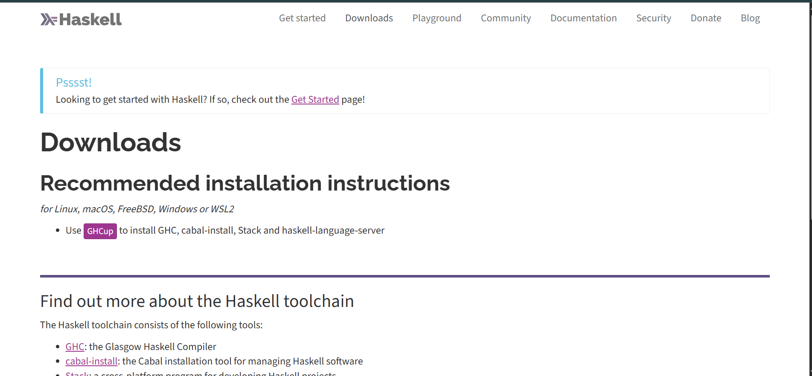
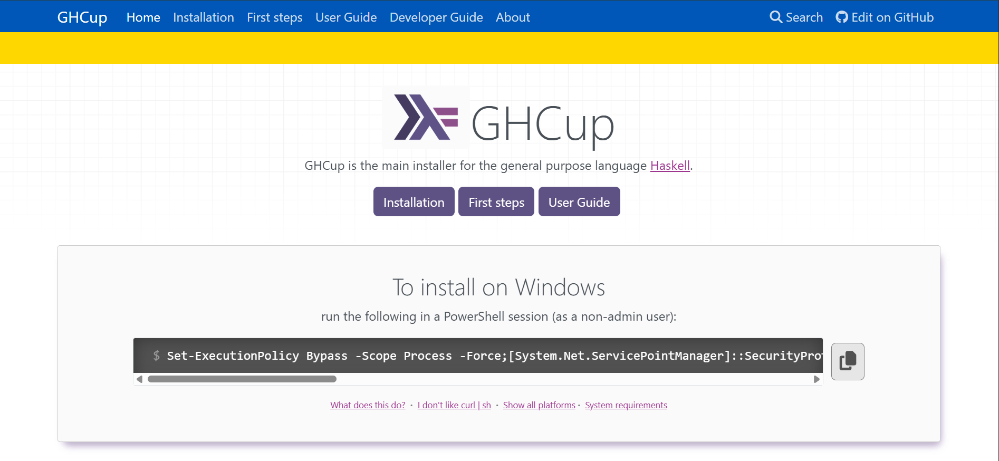
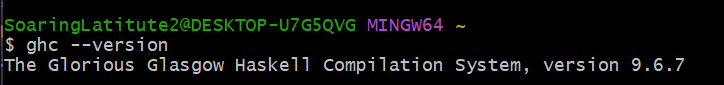

+++
date = '2025-11-20T23:45:32-08:00'
draft = false
title = 'Practica 3: Haskell'
+++

**Alumno:** Hector Alfredo Vasquez Carpio  
**Profesor:** Carlos Gallegos  
**Fecha:** 07/11/2025  
**Materia:** Paradigmas de la programación  

---

## ***Introducción***  

El lenguaje Haskell es un lenguaje de programación funcional puro, ampliamente utilizado en aplicaciones matematicas por sus bases en el calculo lambda.  

A diferencia de lenguajes imperativos como C o Python, Haskell se basa en la evaluación de expresiones y el uso de funciones puras, lo cual representa un paradigma distinto que promueve el razonamiento matemático sobre el código.  

El objetivo de esta práctica es instalar y configurar el entorno de desarrollo de Haskell, conocer las principales herramientas que lo conforman y realizar una breve introducción al lenguaje mediante la implementación de una aplicación “TODO”.  

Esta práctica permite comprender el proceso de instalación, uso de herramientas de compilación y ejecución, así como los principios básicos del paradigma funcional.  

---

## ***Desarrollo***  

### **Instalación del entorno de desarrollo**  

Para comenzar, se accede a la página [pagina](https://www.haskell.org/downloads/), donde se accede al link GHCup para realizar la instalación completa del entorno.  

  

*Acceso y descarga mediante GHCup:*
Al hacer clic en el hipervínculo de GHCup, se abre su página oficial, donde se muestra un comando que debe copiarse y ejecutarse en una ventana de PowerShell (sin privilegios de administrador).  

  

Este comando descarga automáticamente todos los componentes necesarios para programar en Haskell.  

**Componentes instalados:**  

***GHCup:*** Administrador del entorno de desarrollo de Haskell. Se encarga de instalar, actualizar y gestionar versiones de las herramientas.  

***GHC (Glasgow Haskell Compiler):*** Compilador principal del lenguaje Haskell.

***Hugs:*** Intérprete interactivo de Haskell, útil para probar fragmentos de código.

***HLS (Haskell Language Server):*** Proporciona funcionalidades de autocompletado, revisión de errores y soporte para editores de texto.

***Stack:*** Gestor de proyectos y dependencias.  

***Cabal:*** Herramienta de empaquetado y compilación que utiliza Stack para descargar dependencias y GHC para compilar el código.

**Verificación de la instalación:**
Mediante comandos básicos como ghc --version o stack --version se puede comprobar que las herramientas se instalaron exitosamente.
  

Luego se recomienda seguir la guia ***GetStarted*** [getstarted](https://www.haskell.org/get-started/) para tener una breve introduccion a los elementos instalados.

---

#### **TODO**  

El proyecto “Todo” es un ejemplo educativo de cómo construir una pequeña aplicación en Haskell utilizando la herramienta Stack, que sirve para gestionar entornos y dependencias de proyectos Haskell.  

El programa implementa una lista de tareas (todo list) que se ejecuta desde la consola. Su objetivo es enseñar cómo combinar varios conceptos básicos de Haskell —como listas, recursión, entrada/salida (IO), y manejo de funciones puras— dentro de un programa funcional y práctico.  

Cuando el usuario ejecuta el programa con stack run, este muestra un menú con comandos disponibles y espera instrucciones desde la terminal.  

Los comandos permiten:  

+ \<texto> = añadir una nueva tarea

+ \<número> = eliminar una tarea por su índice  

+ s <número> = mostrar una tarea específica

+ e <número> = editar una tarea existente

+ l = listar todas las tareas

+ r = invertir el orden de las tareas

+ c = limpiar toda la lista

+ q = salir del programa

El sistema mantiene las tareas en memoria como una lista de cadenas ([String]). No usa base de datos ni archivos, por lo que los datos se pierden al cerrar el programa.  
Todo el control del flujo se maneja con recursión: cada vez que el usuario introduce un comando, el programa vuelve a llamarse a sí mismo con la lista actualizada.  

Más que ser una herramienta de productividad, el proyecto está pensado como una guía práctica para aprender Haskell.
Permite comprender cómo:  

+ Usar Stack para crear y ejecutar proyectos.  

+ Trabajar con listas y funciones puras.  

+ Integrar operaciones de entrada/salida (IO).  

+ Aplicar pattern matching y recursión en un programa real.  

+ Estructurar un proyecto funcional con módulos y pruebas.  

---

### ***Conclusiones***  

Haskell es un lenguaje de programación funcional, expresivo y fuertemente tipado, diseñado para promover la claridad, la corrección y la seguridad en el código. A diferencia de los lenguajes imperativos, Haskell se basa en funciones puras y evita los efectos secundarios, lo que facilita razonar sobre los programas y detectar errores antes de que ocurran. Su sistema de tipos avanzado y su enfoque declarativo lo convierten en una excelente herramienta para aprender conceptos fundamentales de la programación funcional, así como para desarrollar software confiable y mantenible.

Un buen ejemplo práctico de cómo usar Haskell es el proyecto “Todo”. Esta aplicación de consola muestra cómo combinar la lógica funcional con entrada y salida, listas y recursión, dentro de un entorno real. Es un programa pequeño pero completo, ideal para comprender cómo se construye y ejecuta un proyecto en Haskell.

Haskell me parece un lenguaje bastante raro, muy distinto a los que he usado antes. Lo que más me llama la atención es que está basado en el cálculo lambda, donde aparecen conceptos como redex, reductum y β-reducción, que describen cómo las expresiones se transforman paso a paso. Suena muy teórico, pero entender eso me hace ver que en Haskell todo se trata de aplicar y simplificar funciones. Este aspecto matematico me parece interesante.  

---

### ***Referencias***  

  

[Downloads. (s/f). Haskell.org.](https://www.haskell.org/downloads/)  

[Get started. (s/f). Haskell.org.](https://www.haskell.org/get-started/)  

[GHCup. (s/f). Haskell.org.](https://www.haskell.org/ghcup/)  

[Haskell Tutorial for C Programmers. (s/f). Haskell.org.](https://wiki.haskell.org/index.phptitle=Haskell_Tutorial_for_C_Programmers)  

[How to use Haskell to build a todo app with Stack.](https://dev.to/steadylearner/how-to-use-stack-to-build-a-haskell-app-)  
