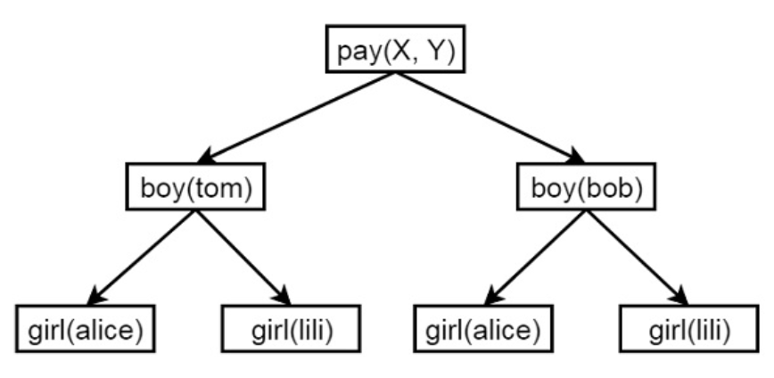

+++
date = '2025-11-20T23:51:20-08:00'
draft = false
title = 'Practica 4: Paradigma logico'
+++

**Nombre:** Hector Vasquez  
**Matricula:** 378827  
**Materia:** Paradigmas de la programacion  
**Profesor:** Carlos Gallegos  

---

## **Introducción**  

En esta práctica se trabajó con el paradigma lógico, un enfoque de programación basado en la representación del conocimiento mediante hechos, reglas y relaciones lógicas. A diferencia de los lenguajes imperativos, donde el programador indica paso a paso cómo resolver un problema, en la programación lógica se describe qué condiciones deben cumplirse, dejando que el motor de inferencias del lenguaje determine cómo alcanzar la solución. Este paradigma resulta especialmente útil para problemas donde intervienen búsquedas, árboles de decisión, relaciones recursivas o exploración de múltiples posibilidades mediante backtracking.  

Para aplicar este enfoque se utilizó Prolog, uno de los lenguajes más representativos del paradigma. Prolog permite expresar relaciones mediante hechos y reglas, y emplea mecanismos como la unificación, la resolución y el backtracking para encontrar respuestas automáticamente. Gracias a estas características, Prolog facilita la resolución de problemas lógicos, matemáticos y estructurales de manera declarativa.  

---

### **Programas hechos en Prolog**

En programación lógica, las listas y otras estructuras de datos se manipulan principalmente mediante recursión, ya que Prolog no utiliza ciclos imperativos tradicionales. Cada problema se construye dividiendo la estructura en partes más pequeñas, aplicando reglas que se llaman a sí mismas hasta llegar a un caso base. Esto permite recorrer listas, analizar sus elementos y construir soluciones de forma declarativa.  

***1. Backtracking***

El backtracking es el mecanismo fundamental mediante el cual Prolog explora diferentes alternativas para resolver una consulta. Cuando una regla no lleva a una solución, Prolog retrocede automáticamente y prueba otra opción disponible. Este comportamiento es ideal para tareas de búsqueda, toma de decisiones y exploración de caminos, ya que permite encontrar una o varias soluciones de forma natural sin programar explícitamente la estrategia de búsqueda.

```pl
boy(tom).
boy(bob).
girl(alice).
girl(lili).
pay(X,Y) :- boy(X), girl(Y).
```

  

***2. Operadores “diferente” y “no”***  

Prolog ofrece herramientas como \= (diferente) y not o \+ (negación) para expresar condiciones lógicas que deben cumplirse o evitarse. Estos operadores permiten restringir soluciones, evitar coincidencias no deseadas y modelar reglas más precisas. Su correcta comprensión es esencial para controlar el flujo lógico de los programas y evitar resultados incorrectos.  

```pl
% -----------------------------
% EJEMPLOS DE DIFERENTE (\=)
% -----------------------------

% Esto solo verifica que dos términos NO puedan unificarse.
son_diferentes(A, B) :-
    A \= B.

% Este predicado dice que un número es positivo,
% pero le ponemos una restricción para que no sea cero.
positivo(N) :-
    N > 0,
    N \= 0.


% -----------------------------
% EJEMPLOS DE NEGACIÓN (\+)
% -----------------------------

% Un número es impar si NO se puede demostrar que es par
impar(N) :-
    \+ par(N).

par(N) :-
    0 is N mod 2.

% Negación usada para evitar elementos prohibidos
permitido(X) :-
    \+ prohibido(X).

prohibido(arma).
prohibido(fuego).
```

***3. Estudio de caso: Árbol***  

Los árboles son estructuras jerárquicas que se representan de manera muy natural en Prolog mediante hechos como parent/2 y reglas recursivas que permiten recorrerlos. A través del estudio de un árbol genealógico, se implementan predicados como predecessor/2 que muestran cómo Prolog puede encontrar relaciones indirectas y navegar estructuras complejas utilizando unificación y recursión.  

```pl
%---------------------------------------------------------
%   Base de datos del árbol genealógico (o jerárquico)
%   Se define un operador infijo "is_parent" para representar
%   la relación Padre -> Hijo de manera más natural.
%--------------------------------------------------------- 

:- op(500, xfx, 'is_parent').

% Hechos: X is_parent Y   significa "X es padre/madre de Y"
a is_parent b.
c is_parent g.
f is_parent l.
j is_parent q.

a is_parent c.
c is_parent h.
f is_parent m.
j is_parent r.

a is_parent d.
c is_parent i.
h is_parent n.
j is_parent s.

b is_parent e.
d is_parent j.
i is_parent o.
m is_parent t.

b is_parent f.
e is_parent k.
i is_parent p.
n is_parent u.

n is_parent v.


/* ---------------------------------------------------------
   Relación de hermanos
   Se define un operador infijo "is_sibling_of".
   Dos nodos X y Y son hermanos si comparten el mismo padre
   y no son el mismo nodo.
   --------------------------------------------------------- */

:- op(500, xfx, 'is_sibling_of').

X is_sibling_of Y :-
    Z is_parent X,      % Z es padre de X
    Z is_parent Y,      % Z es padre de Y
    X \== Y.            % deben ser diferentes (evitar que un nodo sea hermano de sí mismo)


/* ---------------------------------------------------------
   Predicado: leaf_node(Node)
   Determina si un nodo es hoja.
   Un nodo es hoja si NO tiene hijos.
   Se usa negación por falla: \+ is_parent(Node,_)
   --------------------------------------------------------- */

leaf_node(Node) :-
    \+ is_parent(Node, _Child).  
    % Si no existe ningún hecho donde Node sea padre,
    % entonces es un nodo hoja.


/* ---------------------------------------------------------
   Relación de estar al mismo nivel
   Se define el operador infijo "is_at_same_level".
   Dos nodos están al mismo nivel si:
     - Son el mismo nodo, o
     - Sus padres están al mismo nivel recursivamente.
   --------------------------------------------------------- */

:- op(500, xfx, 'is_at_same_level').

% Caso base: un nodo está al mismo nivel que sí mismo.
X is_at_same_level X.

% Caso recursivo: X y Y están al mismo nivel si sus padres
% también están al mismo nivel.
X is_at_same_level Y :-
    W is_parent X,      % W es padre de X
    Z is_parent Y,      % Z es padre de Y
    W is_at_same_level Z.

```

***4. Mínimo y máximo***  

El cálculo de valores mínimos y máximos dentro de una lista ejemplifica el uso de la recursión para comparar elementos paso a paso. Prolog evalúa la lista dividiéndola en subproblemas y utilizando reglas auxiliares para determinar qué valor cumple con la condición buscada. Esto demuestra cómo el paradigma lógico aborda problemas matemáticos sin ciclos ni variables acumuladoras tradicionales.  

```pl
find_max(X, Y, X) :- X >= Y, !.
find_max(X, Y, Y) :- X < Y.
find_min(X, Y, X) :- X =< Y, !.
find_min(X, Y, Y) :- X > Y.
```

***5. Circuitos resistivos***  

Los circuitos resistivos, tanto en serie como en paralelo, pueden modelarse en Prolog describiendo relaciones matemáticas entre resistencias. El enfoque lógico permite definir reglas que calculan valores equivalentes de manera recursiva, mostrando que Prolog también puede aplicarse a problemas ingenieriles y de análisis de sistemas físicos.  

```pl
series(R1,R2,Re) :- Re is R1 + R2.
parallel(R1,R2,Re) :- Re is ((R1 * R2) / (R1 + R2)).
```

***6. Segmentos de recta***  

El análisis de intersección entre segmentos de recta se convierte en un ejercicio ideal para combinar aritmética, condiciones lógicas y casos especiales. Prolog puede implementar métricas como la orientación de puntos o pruebas de colinealidad, aplicando reglas declarativas que determinan si dos segmentos se cruzan o no.  

```pl
vertical(seg(point(X,_),point(X,_))).
horizontal(seg(point(_,Y),point(_,Y))).
oblique(seg(point(X1,Y1),point(X2,Y2))) :- X1 \== X2, Y1 \== Y2.
```

***7. Torre de Hanoi***  

La Torre de Hanoi es un problema clásico que ejemplifica perfectamente la recursión en su forma más pura.  

```pl
move(1,X,Y,_) :-   write('Move top disk from '), write(X), write(' to '), write(Y), nl.
move(N,X,Y,Z) :-   N>1,   M is N-1,   move(M,X,Z,Y),   move(1,X,Y,_),   move(M,Z,Y,X).
```

***8. Listas enlazadas***

Aunque Prolog no utiliza punteros como los lenguajes imperativos, una lista puede funcionar como una estructura enlazada natural. Cada elemento apunta al siguiente. Los ejercicios de listas enlazadas permiten entender cómo navegar, construir y modificar este tipo de estructura usando únicamente recursión y unificación.  

```pl
add_front(L,E,NList) :- NList = node(E,L).
add_back(nil, E, NList) :-   NList = node(E,nil).
add_back(node(Head,Tail), E, NList) :-   add_back(Tail, E, NewTail),   NList = node(Head,NewTail).
```

***9. El mono y el plátano***  

Este problema clásico de planificación muestra la capacidad de Prolog para trabajar con razonamiento automático. A través de hechos y reglas que describen acciones posibles, posiciones y estados, Prolog puede encontrar una secuencia de pasos que permitan al mono obtener el plátano. Esto introduce conceptos de inteligencia artificial dentro del paradigma lógico, demostrando la potencia del lenguaje para resolver tareas basadas en objetivos.  

```pl
move(state(P,onfloor,P,H),   climb,   state(P,onbox,P,H)).
move(state(P1,onfloor,P1,H),   drag(P1,P2),   state(P2,onfloor,P2,H)).
move(state(P1,onfloor,B,H),   walk(P1,P2),   state(P2,onfloor,B,H)).
canget(state(_,_,_,has)).
canget(State1) :-   move(State1,_,State2),   canget(State2).
```

---

## **Conclusiones**

Al finalizar esta práctica, comprendí de manera más profunda cómo funciona el paradigma lógico y por qué Prolog es uno de sus lenguajes más representativos. A diferencia de otros estilos de programación, aquí no se dan instrucciones paso a paso, en cambio, se definen hechos, relaciones y reglas que describen el problema, y el motor lógico encuentra las soluciones mediante un proceso de unificación, inferencia y backtracking. Esta forma de pensar me permitió ver los problemas desde una perspectiva más declarativa y estructurada.  

En general, esta práctica me permitió desarrollar una mejor comprensión del razonamiento declarativo y de cómo Prolog puede aplicarse tanto a problemas matemáticos como a problemas mas sencillos de entender como parentescos familiares. Considero que trabajar con el paradigma lógico amplió mi forma de pensar y me dio una herramienta para enfrentar problemas desde un enfoque muy distinto a lo que llevo trabajando hasta ahora.

---

## **Referencias**

(El repositorio y pagina web que agrego aqui son los finales para el portafolio final, los de anteriores practicas, favor de ignorarlos.)  

[GitHub](https://github.com/HectorVasquez1931/PP_PORTAFOLIO_FINAL)  
[Pagina Web](https://hectorvasquez1931.github.io/PP_PORTAFOLIO_FINAL/)  

Prolog - quick guide. (s/f). Tutorialspoint.com. Recuperado el 22 de noviembre de 2025, de [https://www.tutorialspoint.com/prolog/prolog_quick_guide.htm](https://www.tutorialspoint.com/prolog/prolog_quick_guide.htm)  
